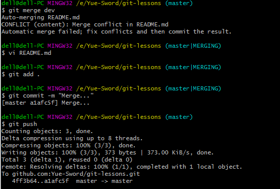

# GIT

>测试有冲突的合并


## git -- 本地新建项目提交到github

1.创建本地文件夹git-lessons -> README.md

在本地文件夹git-lessons下执行指令

```bash
git init
```

2.在github上创建一个同名git-lessons项目 ->  [LICENSE](https://github.com/Yue-Sword/git-lessons/blob/master/LICENSE)

3.设置远程仓库地址

```bash
git remote add origin git@github.com:Yue-Sword/git-lessons.git
```

4. 拉取并合并本地仓库与远程仓库： 

```bash
git pull --rebase origin master
```

5. 提交本地代码

> 第一次推送，需要添加 `--set-upstream` 或 `-u`，意思是设置已有的本地分支跟踪一个刚刚拉取下来的远程分支， 或者说要推送当前分支并将远程设置为上游

```bash
git add .
git commit -m "xxx"
git push --set-upstream origin master
```

## git -- 新建、切换、删除分支

- 从已有的分支上创建新分支

```bash
git checkout -b dev
git add .
git commit -m 'create dev'
git push --set-upstream origin dev
```

## git -- 合并分支

- 无冲突的合并

  ```bash
  git merge dev
  ```

- 有冲突的合并

  > 示例：向master中合并dev分支并存在冲突，首先需要找到冲突点，合并解决冲突，并提交

  

